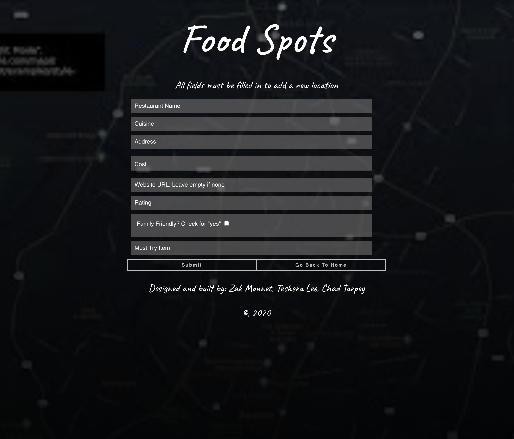

# Time-Zone-Traveler

---

### Table of Contents
- [Description](#description)
- [How To Use](#how-to-use)
- [License](#license)
- [Author Info](#author-info)
---

---

# Purpose
---
To find great places to eat for travelers that was found by other travelers.

# Built With these Technologies
* HTML
* CSS
* JavaScript
* VS Code
* Node.js
* Express.js
* Handlebars.js
* Mapbox api
* Foundations CSS

## Description
* 

---
## How To Use
- Visit   https://eatandplay.herokuapp.com
- Google Chrome or any Web Browser
---
## References
- http://www.youtube.com
- http://www.github.com
- http://www.w3schools.com
- Vanderbilt/Triolgy Coding Bootcamp
---
## License
MIT License
Copyright (c) [2020] [Chad M Tarpey] [Zak Monnet] [Teshera Lee]
Permission is hereby granted, free of charge, to any person obtaining a copy
of this software and associated documentation files (the "Software"), to deal
in the Software without restriction, including without limitation the rights
to use, copy, modify, merge, publish, distribute, sublicense, and/or sell
copies of the Software, and to permit persons to whom the Software is
furnished to do so, subject to the following conditions:
The above copyright notice and this permission notice shall be included in all
copies or substantial portions of the Software.
THE SOFTWARE IS PROVIDED "AS IS", WITHOUT WARRANTY OF ANY KIND, EXPRESS OR
IMPLIED, INCLUDING BUT NOT LIMITED TO THE WARRANTIES OF MERCHANTABILITY,
FITNESS FOR A PARTICULAR PURPOSE AND NONINFRINGEMENT. IN NO EVENT SHALL THE
AUTHORS OR COPYRIGHT HOLDERS BE LIABLE FOR ANY CLAIM, DAMAGES OR OTHER
LIABILITY, WHETHER IN AN ACTION OF CONTRACT, TORT OR OTHERWISE, ARISING FROM,
OUT OF OR IN CONNECTION WITH THE SOFTWARE OR THE USE OR OTHER DEALINGS IN THE
SOFTWARE.
---
## Authors Info
---

## Chad Tarpey
- Email - [chadtarpey@gmail.com](chadtarpey@gmail.com)
- Github - [github.com/chadtarpey615]
## Teshera Lee    
- Email - [tcasey0825@gmail.com](tcasey0825@gmail.com)
- Github - [github.com/tlee0825]
## Zak Monnet
- Email - [zakmonnet@gmail.com](zakmonnet@gmail.com)
- Github - [github.com/outoftune266]
